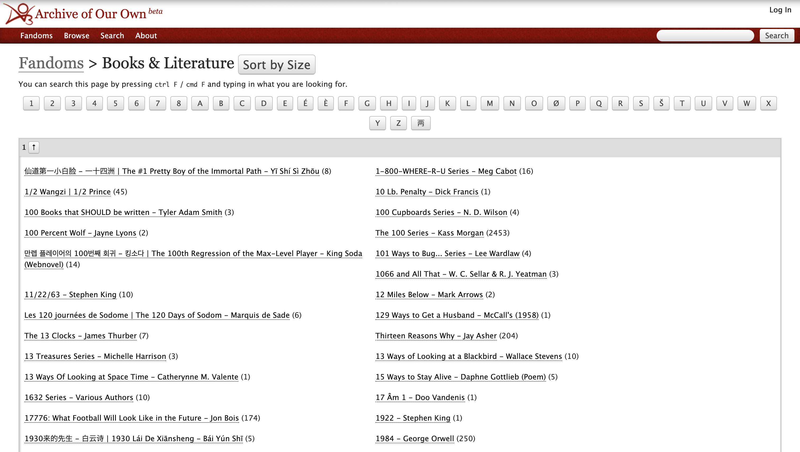
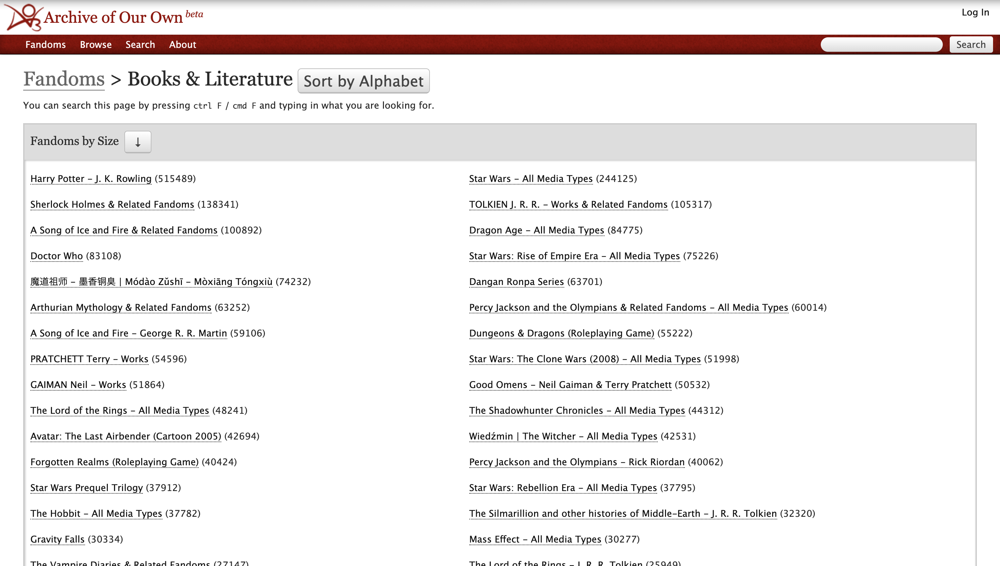

A Google Chrome browser extension that reorders the fandom list by number of works instead of alphabetically. Currently in review for publication to Chrome Web Store. In the meantime, you can still use the extension through Chrome Developer Mode.

The browser extension adds a button to any AO3 fandom list page, labelled 'Sort by Size.' Click the button to reorder the list. You can switch between descending and ascesding order by clicking the arrow in the header. You can revert the list by clicking the 'Sort by Alphabet' button.

Default:

Reordered:
